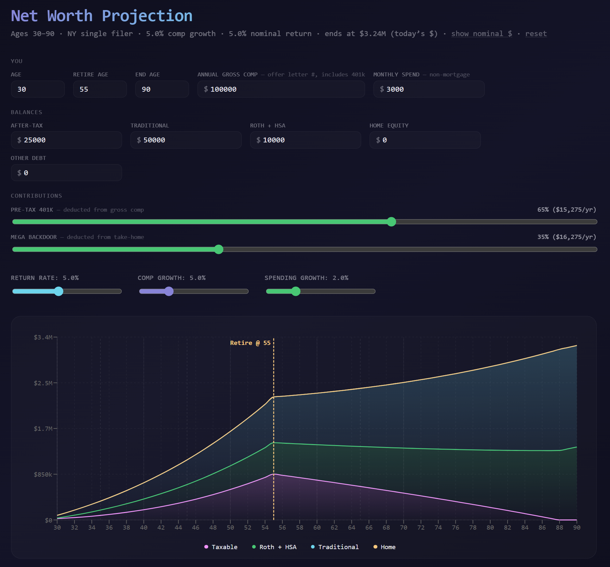

# FIRE Calculator

Tax-aware net worth simulator with real federal/state brackets, retirement withdrawal modeling, and interactive exploration. Built for people who want to answer **"what happens to my money if I retire at X?"** without trusting a black-box SaaS.

**[Live Demo →](https://cmihran.github.io/fire-calc/)**



## What it does

Enter your income, spending, and account balances. Drag sliders to explore return rates, comp growth, and spending inflation. Drag the retirement line on the chart to see how different retire-at ages affect your trajectory.

The simulation runs annually with:
- **Real tax brackets** — 2026 federal (single + MFJ), NY and CA state, NYC local
- **FICA** — Social Security wage cap + additional Medicare above $200k
- **Income-aware LTCG** — 0% / 15% / 20% federal brackets + 3.8% NIIT
- **Retirement withdrawal grossup** — Traditional pulls taxed as ordinary income, 10% early-withdrawal penalty before 59½, Roth tax-free
- **Withdrawal ordering** — Taxable → Traditional → Roth (tax-efficient default)
- **Contribution modeling** — Pre-tax 401(k) + employer match + mega backdoor Roth, limits growing annually

The stacked area chart shows where your net worth lives (Traditional / Roth / Taxable / Home equity) so you can see the composition shift over time, not just the total line.

## Quick start

```bash
git clone https://github.com/cmihran/networth-calc.git
cd networth-calc
npm install --legacy-peer-deps
npm run dev
```

Edit `src/config/quickConfig.ts` to set your starting numbers (the `YOU` block — ~12 fields). Or just use the in-page Settings panel.

## How inputs work

| Input | Where | Notes |
|-------|-------|-------|
| Age, income, spending, balances | Settings panel (in-page) | Persists to localStorage |
| Return rate, comp growth, spending growth | Sliders (in-page) | Drag to explore scenarios |
| Retirement age | Drag the gold line on the chart | Or edit in Settings |
| Filing status, state, employer match, tax drag | `src/config/quickConfig.ts` → `ASSUMPTIONS` | Rarely changed |

**Balances are by tax treatment, not by account.** You have 3 buckets:
- **After-tax** — cash + brokerage (subject to LTCG + tax drag)
- **Traditional** — 401(k) + Traditional IRA (pre-tax in, ordinary income out)
- **Roth** — Roth 401(k) + Roth IRA + HSA (tax-free qualified withdrawals)

**Contributions** are percentage of IRS max — slider from 0–100%. Limits grow at 2.5%/yr automatically.

## Nominal vs real dollars

Click "show today's $" in the header to see all values deflated by inflation. The simulation always runs in nominal dollars; the toggle is display-only.

## What's not modeled (yet)

- AMT
- Roth conversion ladders during low-income years
- 72(t) SEPP for penalty-free early withdrawals
- Social Security / pensions
- RMDs at 73+
- Equity vesting (ISO/NSO/RSU)
- Multi-scenario overlay comparison
- Itemized deductions (uses an approximate state deduction)

## Adding a state

Tax brackets live in `src/engine/tax.ts`. To add a state:

1. Add the state code to the `StateCode` type in `src/types/index.ts`
2. Add brackets to `STATE_BRACKETS` in `tax.ts`
3. Optionally add local brackets to `LOCAL_BRACKETS`

## Tech

Vite + React 19 + TypeScript + Recharts. ~950 lines of application code. No backend, no build server, no database. State lives in localStorage. Runs entirely in your browser.

```
npm run dev          # dev server
npm run build        # production build
npm run typecheck    # type check
```

## License

MIT
